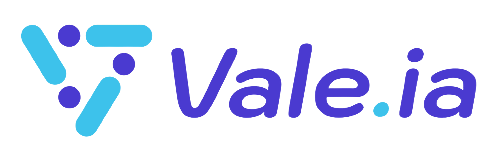

# Vale.ia - Asistente Virtual de Ventas 🤖

<div align="center">
  
  
  [](https://nextjs.org/)
  [](https://reactjs.org/)
  [](https://tailwindcss.com/)
  [](https://www.contentful.com/)
</div>

## 🌟 Características

- 🎨 Diseño moderno y responsive
- 🌓 Modo oscuro/claro
- 📱 Optimizado para móviles
- 🚀 Rendimiento optimizado
- 📝 Blog integrado con Contentful
- 💳 Sistema de precios y planes
- 🔄 Casos de uso interactivos
- 🌍 SEO optimizado

## 🛠️ Tecnologías

- **Frontend:**
  - Next.js 14
  - React 18
  - Tailwind CSS
  - AOS (Animate On Scroll)
  - Chart.js
  - SweetAlert2

- **CMS:**
  - Contentful

- **Optimización:**
  - Sharp (optimización de imágenes)

## 🚀 Inicio Rápido

1. **Clonar el repositorio**
   ```bash
   git clone https://github.com/tu-usuario/vale-ia.git
   cd vale-ia
   ```

2. **Instalar dependencias**
   ```bash
   npm install
   ```

3. **Configurar variables de entorno**
   
   Crea un archivo `.env.local` en la raíz del proyecto:
   ```env
   NEXT_PUBLIC_CONTENTFUL_SPACE_ID=tu_space_id
   NEXT_PUBLIC_CONTENTFUL_ACCESS_TOKEN=tu_access_token
   ```

4. **Iniciar el servidor de desarrollo**
   ```bash
   npm run dev
   ```

   Abre [http://localhost:3000](http://localhost:3000) en tu navegador.

## 📁 Estructura del Proyecto

```
vale-ia/
├── public/           # Archivos estáticos
├── src/
│   ├── app/         # Páginas y rutas
│   ├── components/  # Componentes React
│   ├── hooks/       # Custom hooks
│   ├── libs/        # Utilidades y helpers
│   └── utils/       # Funciones utilitarias
├── .env.local       # Variables de entorno locales
└── package.json     # Dependencias y scripts
```

## 🔧 Scripts Disponibles

- **Desarrollo:**
  ```bash
  npm run dev
  ```

- **Construcción:**
  ```bash
  npm run build
  ```

- **Producción:**
  ```bash
  npm start
  ```

- **Linting:**
  ```bash
  npm run lint
  ```

## 📱 Características Responsive

- Mobile First Design
- Breakpoints:
  - xs: 320px
  - sm: 576px
  - md: 768px
  - lg: 992px
  - xl: 1200px
  - 2xl: 1366px
  - 3xl: 1500px
  - 4xl: 1921px

## 🎨 Temas

El proyecto incluye un sistema de temas claro/oscuro que se puede alternar fácilmente. Los temas están implementados usando Tailwind CSS y clases personalizadas.

## 🔒 Seguridad

- CORS configurado
- Headers de seguridad
- Sanitización de entradas
- Protección contra XSS

## 📄 Licencia

Este proyecto está bajo la Licencia MIT - ver el archivo [LICENSE.md](LICENSE.md) para más detalles.

## 📞 Soporte

- Email: hola@whitelabel.lat
- Website: [ValeIa](https://valeia.tech)
- Documentación: [Documentacion](https://valeia.tech/docs)

## ⭐ Agradecimientos

- [Next.js Team](https://nextjs.org/)
- [Tailwind CSS](https://tailwindcss.com/)
- [Contentful](https://www.contentful.com/)
- Todos los contribuidores que han participado en este proyecto

---

<div align="center">
  Desarrollado con ❤️ por [WhiteLabel](https://whitelabel.lat)
</div>
